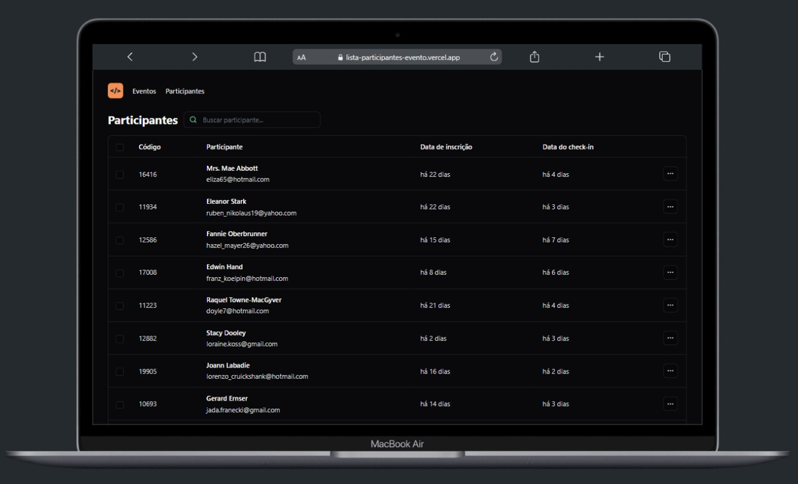

<h1 align="center">Lista de participantes de eventov</h1>
🔎 Bem-vindo ao meu portfólio!

 
🗔 Confira a aplicação: https://lista-participantes-evento.vercel.app  

:page_facing_up: Explicação
Este repositório contém os arquivos do projeto "Lista de Participantes de Evento", uma aplicação front-end em ReactJS. Esta aplicação permite listar participantes de um evento, realizar buscas, navegar pelas páginas da lista e visualizar detalhes de cada participante. O projeto foi desenvolvido utilizando conceitos de Propriedades, Estados e Componentes em ReactJS, tipagem com Typescript, ferramenta Vite para tooling e interface responsiva com TailwindCSS.

📁 Estrutura do Projeto

components: 
- AttendeeList.tsx: Componente principal da aplicação.
- IconButton.tsx: Componente de botão de ícone.
- Table.tsx: Componente de tabela.
- TableHeader.tsx: Componente de cabeçalho da tabela.
- TableCell.tsx: Componente de célula da tabela.
- TableRow.tsx: Componente de linha da tabela.

dados: 
- attendees.ts: Arquivo de dados simulados dos participantes do evento.
- App.tsx: Arquivo principal da aplicação.
- index.tsx: Arquivo de entrada da aplicação.

🚀 Tecnologias Utilizadas
- ReactJS: Biblioteca JavaScript para construção de interfaces de usuário.
- Typescript: Superset JavaScript que adiciona tipagem estática ao código.
- Vite: Build tool para aplicações web modernas.
- TailwindCSS: Framework CSS utilitário para construção de interfaces responsivas.

Agradecemos às seguintes pessoas que contribuíram para este projeto:

## 🤝 Colaboradores

<table>
  <tr>
    <td align="center">
      <a href="#">
         
        
          <b>Diogo Kimisima</b>
        
      </a>
    </td>
  </tr>
</table>

## 📝 Licença

Este projeto está sob licença. Consulte o arquivo <a href="https://github.com/diogokimisima/Lista-participantes-evento/blob/main/LICENSE">LICENSE</a> para obter mais detalhes.

<a href="#top">Volte para o topo</a>
